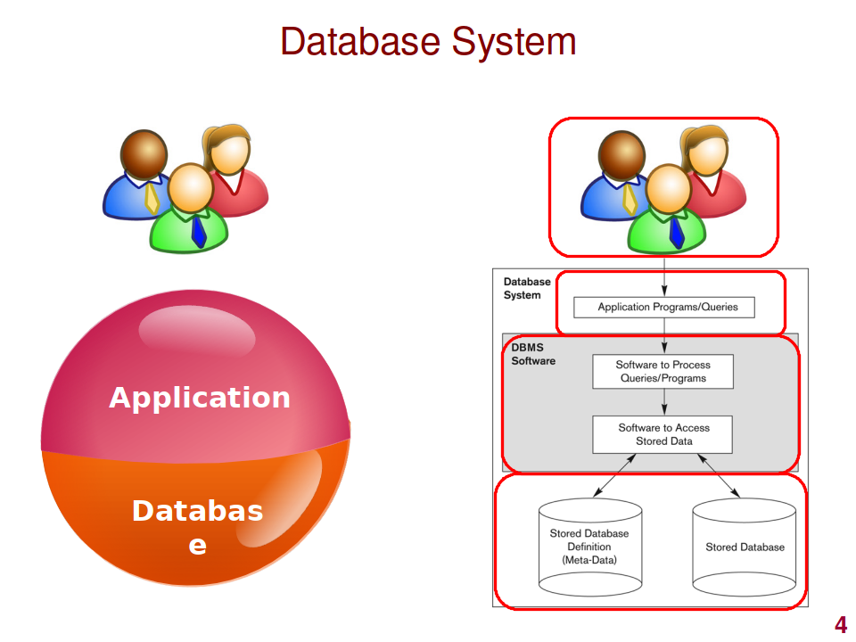
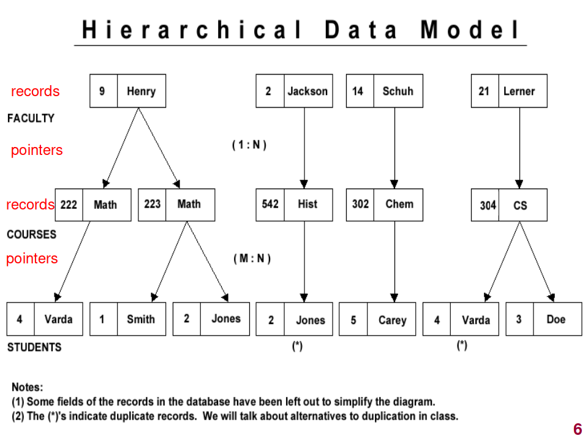
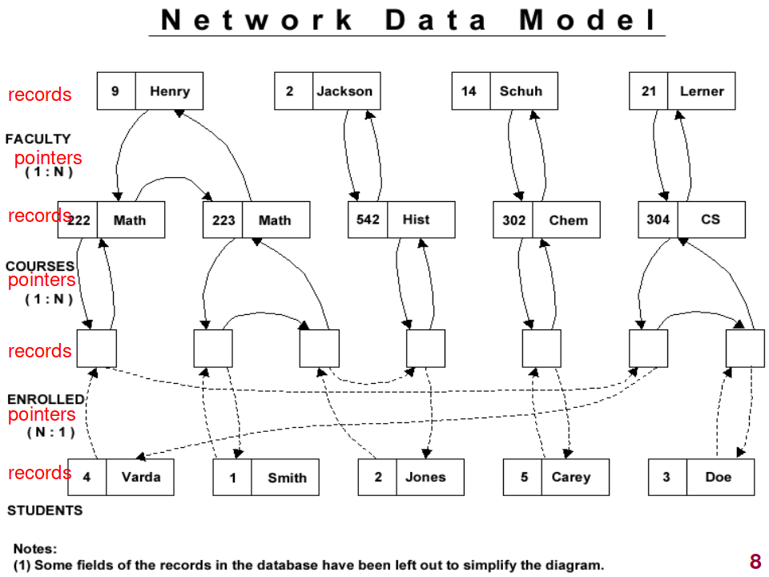
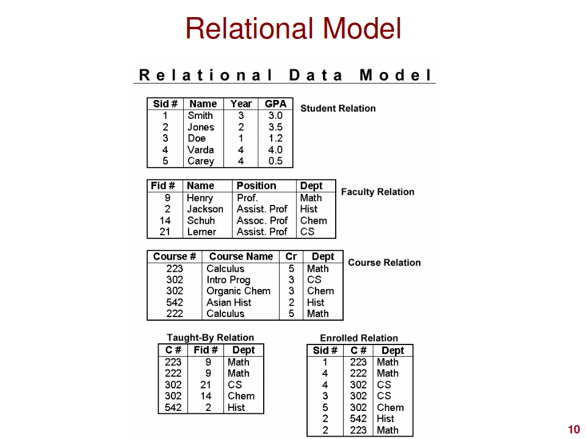
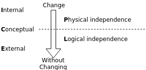
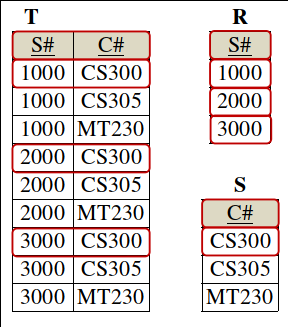
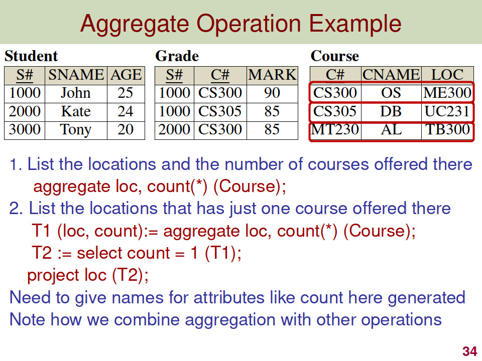
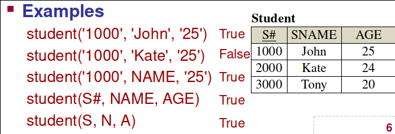

---
author: 
- William Findlay
title: 3005 Final Full Notes 
date: \today
bibliography: /home/housedhorse/.bibs/uni.bib
csl: /home/housedhorse/.bibs/ieee.csl
header-includes:
  \usepackage{float}
  \usepackage{amsmath}
  \let\origfigure\figure
  \let\endorigfigure\endfigure
  \renewenvironment{figure}[1][2] {
      \expandafter\origfigure\expandafter[H]
  } {
      \endorigfigure
  }
output:
  pdf_document:
    number_sections: true
    fig_crop: true
    fig_caption: true
    keep_tex: false
---
\newpage
\tableofcontents
\newpage

# Definitions

## Database Terms
- **Database**
  - a collection of related data stored on a computer
- **Data**
  - a value which represents known facts with an implicit meaning
- **Mini world**
  - some part of the real world which is represented by the data stored in the database
- **Database management system** (DBMS)
  - software to facilitate creation and maintenance of a database
- **Database system**
  - database and...
  - the application programs developed on top of the DBMS

## Actors
### Behind the Scenes
- **System designer**
  - design and implement DBMS modules
- **Tool developer**
  - design and implement tools
    - modeling
    - designing
    - performance monitoring
    - prototyping
    - test data generation
    - UI creation
    - simulation
- **Operator and maintenance personnel**
  - tunnel rats
  - manage the running and maintenance of the DB

### On the Scene
- **DBA** (database administrator)
  - acquire software and hardware resources
  - control the use of those resources
  - monitor efficiency
  - monitor use of DB
  - authorize access to DB
- **DB designer**
  - define the following aspects of a DB:
    - structure
    - constraints
    - content
    - transactions
  - must understand end users' needs
- **System analyst**
  - design applications and canned transactions for a DB 
- **Application developer**
  - implement the specifications developed by analysts
- **End user**
  - use DB day-to-day
  - don't know or care how DB is structured
  - two categories:
    - na&iuml;ve users
    - business analysts

## Data Models
- **Data model**
  - way of representing data in a meaningful way
  - how data is *structured* and *operated*
  - three parts:
    - concepts to describe structure
    - operations for manipulating structures
    - constraints which must be obeyed
  - **entity relationship model**
    - entities connected by relationships
  - **hierarchical model**
    - tree-like structure
    - group by records and links
    - navigational and procedural operations
  - **network model**
    - network structure
    - grouped by records and links
    - navigational and procedural operations
  - **relational model**
    - tables
    - tuples in relations
    - declarative operations
- **Constructs**
  - a data model concept which defines the structure of the DB
  - elements and their types
  - groups of elements
  - relationships between such groups
- **Operations**
  - basic model operations
    - `insert`
    - `delete`
    - `update`
    - `query`
  - user-defined operations
    - `compute_gpa`
    - `update_inventory`
- **Constraints**
  - specify restrictions on the data
  - implicit
    - defined by data model chosen
    - **entity integrity** constraint
      - primary key value cannot be null
    - **referential integrity** constraint
      - foreign key value must exist in the primary key of the referenced relation
    - **key** constraint
      - key values must be unique
    - **domain** constraint
      - values must exist in the domain of an attribute
  - explicit
    - expressed in the schema
    - using facilities provided by the model
  - semantic
    - defined in application programs
- **Physical data model**
  - low level
  - describe how data is stored physically
- **Conceptual data model**
  - high level
  - how the user will perceive data
  - how the user will access/modify data
- **Implementation data model**
  - somewhere between physical and conceptual
  - the sum of those two parts
- **Self-describing data model**
  - description of the data is combined with its values
- **Database schema**
  - description of data at some abstraction level
  - just the relations and attribute names
  - also called **intension**
- **Database instance**
  - a snapshot of the data at a given point in time
  - relations, attribute names, tuples
  - also called **extension**

## Database Languages
- **DDL** (data definition language)
  - add or remove data
- **DML** (data manipulation language)
  - change data
- **QL** (query language)
  - query data

## Relational Database Definitions
- **Schema of a relation**
  - denoted by $R(A_1,A_2,...,A_n)$
  - $R$ is the **name**
  - $A_1,A_2,...,A_n$ are the **attributes**
- **Tuple**
  - ordered set of values
  - written : $<V_1,V_2,...,V_n>$
    - each value $V_n$ is derived from an appropriate domain
  - an $n$-$tuple$ is a tuple with $n$ values
- **Domain**
  - three parts:
    - name
    - data type
    - set of **atomic** values (indivisible values)
- **Attribute**
  - attribute name designates a role played by a domain in a relation
  - can be the same as a domain name
    - e.g., a user-defined type `Name` which is the domain of an attribute also called `Name`
- **Cartestian product**
  - let $D_1,D_2,...,D_n$ be a set of $n$ domains
  - cartesian product on $D_1,D_2,...,D_n$ is
    - $\{<d_1,d_2> \mid{} d_1$ in $D_1,$ $d_2$ in $D_2\}$
- **Relation**
  - a relation $R$ of degree $n$ on a collection of domains $D_1,D_2,...,D_n$ consists of the following:
    - a schema $R(A_1,A_2,...,A_n)$ $\mid$ $domain(A_i)=D_i$ with a one-to-one mapping
    - an instance $r$ or $R$ denoted by $r(R)$ $\mid$ $r(R)\subset{}D_1\times{}D_2\times{}...D_n$
- **Superkey**
  - set of attributes such that no tuple has the same set of values for those attributes
- **Key**
  - a minimal superkey
  - i.e., no excess attributes
- **Primary key**
  - chosen, typically from the smallest key
- **Candidate keys**
  - every key in a relation
  - primary key selected from this pool
- **Secondary key**
  - candidate keys which are not chosen as primary key
- **Prime attribute**
  - member of some candidate key
- **Nonprime attribute**
  - not a member of any candidate key

## TRC and DRC
- **Bound variable**
  - quantified variable
  - i.e., appears in a $\forall$ or $\exists$ clause
- **Free variable**
  - not quantified
  - i.e., does **not** appear in a $\forall$ or $\exists$ clause
  - a free variable **MUST** appear in the query result

# Intro

## Types of Database
- We are only concerned with **traditional applications**
- Business Data Processing (Numeric and Textual)

{height=50%}

## DBMS Functionality
- **Load** initial database contents on a secondary storage medium
- **Define** a database in terms of:
  - data types
  - data structures
  - constraints
- **Manipulate** the database
  - retrieve
    - query
    - generate reports
  - modify
    - insert
    - delete
    - update
  - access
    - through web applications which provide a graphical front end
- **Handle concurrency** from multiple users
- **Security measures** to restrict unauthorized access
- **Presentation and visualization** of data
- **Maintenance** of database and application programs

## Application/Database Interaction
- **Queries**
  - access data according to specifications and return a result
- **Transactions**
  - read data and update
  - store new data
- **No unauthorized access**
- Keep up with changing user requirements

## Characteristics of the Database Approach
- **Self-Describing**
  - **catalog** stores descriptions of a database
    - data structures
    - data types
    - constraints
  - the description is called **meta-data**
  - allows the DBMS to work with many different applications
- **Insulation**
  - we can change the way the data is structured and organized without changing the application programs
- **Abstraction**
  - a **data model** is used to hide details
    - presents users with a *conceptual view* of the database
    - programmers refer to model constructs and not the nitty-gritty details
- **Multiple views**
  - each user can see a different view 
  - **only see the data they care about**
- **Sharing data and multi-user transactions**
  - allow **concurrent** retrieval and modification of database
  - *concurrency control* guarantees either:
    - correct execution of a transaction OR
    - abortion of a transaction
  - *recovery* subsystem ensures each transaction's effect is correctly recorded
  - **OLTP** (online transaction processing) allows hundreds of concurrent transactions per second

## Types of Database User
### Actors Behind the Scenes
Those who design and develop DBMS software. Those who operate the computer systems.

- System designers and implementers
  - design and implement DBMS modules
- Tool developers
  - design and implement tools
    - modeling
    - designing
    - performance monitoring
    - prototyping
    - test data generation
    - UI creation
    - simulation
- Operators and maintenance personnel
  - tunnel rats
  - manage the running and maintenance of the DB

### Actors on the Scene
Those who actually use and control the database content. Those who design, develop, and maintain database applications.

- DB administrators
  - acquire software and hardware resources
  - control the use of those resources
  - monitor efficiency
  - monitor use of DB
  - authorize access to DB
- DB designers
  - define the following aspects of a DB:
    - structure
    - constraints
    - content
    - transactions
  - must understand end users' needs
- System analysts
  - design applications and canned transactions for a DB 
- Application developers
  - implement the specifications developed by analysts
- End users
  - use DB day-to-day
  - don't know or care how DB is structured
  - two categories:
    - na&iuml;ve users
    - business analysts

# Database System Concepts and Architecture
## Data Representation
- We need to *abstract* the representation to make it meaningful

### Hierarchical Model
- Tree-like structure
  - records
  - links
- Navigational and procedural operations

{height=33%}

### Network Model
- Network structure
  - records
  - links
- Navigational and procedural operations

{height=33%}

### Relational Model
- Tuples and relations
- Declarative operations specify what to get instead of how to get it

{height=33%}

## Schemas
- Description of the data at some abstraction level
- Three levels, each with its own schema:
  - internal (physical)
    - how the data is stored, physically
    - physical storage structures
    - access paths
  - conceptual
    - structure and constraints for the whole database
    - high-level or implementation data model
  - external
    - user views
    - typically same data model as conceptual schema
- Physical data independence
  - change internal schema without changing the conceptual schema
- Logical data independence
  - change conceptual schema without changing external schema
- See \autoref{icepl} for a trick here (ICE PL)



- Two important physical models
  - centralized
    - can still remote in but all processing is done centrally
  - client/server

## Database Languages
- DDL (data definition language)
  - `insert`
  - `delete`
- DML (data manipulation language)
  - `update`
- QL (query language)
  - `get`
- SQL
  - combines all three

# Relational Databases
## Concepts
- Relation name
- Attributes (schema)
  - column headers
- Tuples (instance)
  - rows of entries in the table
- Domain
  - the set of all possible values of an attribute

## Summary of Definitions
Informal Terms             Formal Terms
-------------------------- ------------
Table                      Relation
Column Name                Attribute
All Possible Column Values Domain
Row                        Tuple
Table Definition           Schema of a Relation
Populated Table            Instance of a Relation
---

## Characteristics of a Relation
- No duplicate tuples
  - that is an instance of a relation is a **set of tuples**
- This set of tuples is unordered
  - a set has no order
- Attributes of a relation are unordered
  - the heading is a set
- All domains consist of atomic values only
  - `NULL` can be assigned to values which are unknown or inapplicable
  - providing there is no `not null` constraint

## Accessing a Tuple's Members
- We define a $n$-$tuple$ $t$ as follows:
  - $t=<A_1:v_1,...,A_n:v_n>$
- Accessing a single element is trivial and can be done in two ways:
  - $t[A_i]$
  - $t.A_i$
- Accessing multiple elements can be done as follows:
  - $t[A_u,A_v,A_w]=<v_u,v_v,v_w>$

## Constraints
- **Implicit** (inherent) constraints
  - based on the data model itself
  - relational model does not allow a list as a value
    - *values* must be *atomic*
- **Explicit** (schema-based) constraints
  - expressed in the schema
  - uniqueness
  - not null
  - primary key
  - etc.
- **Semantic** (application-based) constraints
  - beyond the scope of what can be defined in a data model
  - defined and enforced in application programs

**In the relational model, we separate into three further categories of constraint:**

- **Key** constraints
  - for any superkey of $R$, the following will hold, provided $R$ is in a **valid state**:
    - no two tuples will have the same attributes for the superkey
    - that is, $t_i[superkey]\ne{}t_j[superkey]$
  - for any key of $R$, the following will hold, provided $R$ is in a **valid state**:
      - the key is a superkey such that the removal of any of its attributes will violate the superkey constraint above
  - the primary key is chosen, typically from the smallest key
    - sometimes it makes more sense to choose something else
- **Entity integrity** constraints
  - the primary key attribute(s) of each relation schema $R$ cannot have null values
- **Referential integrity** constraints
  - referencing relation, referenced relation
    - these *can* be the same relation
  - **referencing** relation has *foreign key* attributes which identify the **referenced relation**
  - the value(s) of a foreign key must be either an existing primary key value in the referenced relation or null
- And *implicitly* a fourth constraint, the **domain constraint**
  - that is, every value in a tuple must be from the domain of its attribute

## Any Problems?
- Modification operations pose an issue
  - updates shouldn't violate integrity constraints
  - may be necessary to cascade updates to preserve integrity
  - the `INSERT` problem
    - insert may violate any of the three constraints outlined above or the domain constraint
    - domain
      - if one of the values for the inserted tuple is not in the attribute's domain
    - key
      - if the value(s) of the key attribute in the new tuple already exist(s) in another tuple in the relation
    - referential integrity
      - if a foreign key in the new tuple references a primary key value which does not exist in the referenced relation
    - entity integrity
      - primary key value is null in the new tuple
  - the `DELETE` problem
    - can cause a referential integrity problem in all referencing relations, if one or more exists
    - solutions include
      - reject the deletion
      - cascade the deletion
      - set the foreign keys in referencing relations to null
  - the `UPDATE` problem
    - an `UPDATE` can be regarded as an `INSERT` followed immediately by a `DELETE`
    - depending on the attribute being updated, a number of issues can occur
      - **foreign key** $\implies$ possible referential integrity violation or domain violation
      - **primary key** $\implies$ possible key constraint, referential integrity, entity integrity, or domain violation
      - **ordinary attribute** $\implies$ only domain constraint can be violated

# ALG
- **Relational algebra**
- Basic set of operations for the relational model
- Specifies queries
- *Closed*, meaning
  - Each operation
    - takes one or two relations
    - generates one new relation
- The result of a relational algebra expression is a relation that represents the database query

## A Summary of the Possible Operations
### Unary Operations
- `SELECT` ($\sigma$)
  - choose tuples (rows)
  - `SELECT <condition> (R)`
  - $\sigma_{<condition>}(R)$
- `PROJECT` ($\pi$)
  - choose attributes (columns)
  - `PROJECT <attributes> (R)`
  - $\pi_{<attributes>}(R)$
- `RENAME` ($\rho$)
  - change relation name and/or attribute names
    - this is required for some operations to succeed, like `JOIN`
  - change relation name to $S$ and attribute names to $B_1,...,B_n$
    - `RENAME R to S(B1,...,Bn)`
    - $\rho_{S(B_1,...,B_n)}(R)$
  - change relation name to $S$
    - `RENAME R to S`
    - $\rho_{S}(R)$
  - change attribute names to $B_1,...,B_n$
    - `RENAME R to (B1,...,Bn)`
    - $\rho_{(B_1,...,B_n)}(R)$
  - does **not** change the original relation
    - still a query operation only
    - returns a copy with the desired names changed

### Binary Operations
- `UNION` ($\cup$)
  - $\{a_1,a_2,a_3\}\cup\{a_2,a_3,a_4\}=\{a_1,a_2,a_3,a_4\}$
  - **compatibility requirement** on:
    - domain
    - number of attributes
- `INTERSECTION` ($\cap$)
  - $\{a_1,a_2,a_3\}\cap\{a_2,a_3,a_4\}=\{a_2,a_3\}$
  - **compatibility requirement** on:
    - domain
    - number of attributes
- `DIFFERENCE` or `MINUS` ($-$)
  - $\{a_1,a_2,a_3\}-\{a_2,a_3,a_4\}=\{a_1\}$
  - $\{a_2,a_3,a_4\}-\{a_1,a_2,a_3\}=\{a_4\}$
  - **compatibility requirement** on:
    - domain
    - number of attributes
- `CARTESIAN PRODUCT` ($\times$)
  - $R\times{}S$ combines tuples of $R$ and $S$ $\mid$ every combination of the tuples is represented
- `JOIN` ($\bowtie$)
  - can be thought of as $\times$ followed by $\sigma$
  - let $R$ and $S$ be **any two relations**
  - `THETA JOIN` or $\bowtie_{A \theta B}$ $\mid$ $\theta$ is one of $\leq,<,>,\geq,=,\ne$
    - `R JOIN S (conditions)`
    - $R\bowtie_{<conditions>}S$
    - if $\theta$ is $=$, this is called an `EQUIJOIN`
  - `NATURAL JOIN` or `NJOIN` or $\bowtie$
    - `R NJOIN S`
    - `R NATURAL JOIN S`
    - $R\bowtie{}S$
      - no $\theta{}$ here
    - this works like an equijoin for the shared attribute(s) and removes the duplicate attribute(s)
    - optionally, provide **attribute(s) to join from** like so:
      - `R NJOIN S (A)`
      - $R \bowtie_{<attribute(s)>} S$
- `DIVIDEBY` ($/$)
  - please see \autoref{divideby} for an illustration of the following properties
  - let $S\times{}R$ be $T$
  - the following holds:
    - $T/S=R$
    - $T/R=S$
  - $T/R=S$ has the following properties:
    - $T$ has all attributes of $R$ and more
    - $S$ has attributes $T-R$
    - a tuple $t$ will appear in $S$ $\iff$ values in $t$ appear in $T$ with every tuple in $R$

{height=33%}

### Additional Operations
- `OUTER JOIN`
  - any problem with $\theta$-$join$? 
    - if there is a tuple in $R$ or $S$ which does not join with the other relation, we lose information
    - sometimes this *is* desired behavior, sometimes not
  - the solution? `OUTER JOIN` operations
  - `R LEFTJOIN S (A)` $\implies$ keep all tuples in `R`
  - `R RIGHTJOIN S (A)` $\implies$ keep all tuples in `S`
  - `R FULLJOIN S (A)` $\implies$ keep all tuples in `R` and `S`
  - `R NLEFTJOIN S (A)` $\implies$ keep all tuples in `R`, discard duplicate attributes
  - `R NRIGHTJOIN S (A)` $\implies$ keep all tuples in `S`, discard duplicate attributes
  - `R NFULLJOIN S (A)` $\implies$ keep all tuples in `R` and `S`, discard duplicate attributes
- `OUTER UNION`
  - works for partially tuple compatible relations
    - that is to say the domains need not match except for at least one attribute
    - this attribute will be the unifying attribute
  - behaves like a full outer join if the join attributes are all common attributes
  - `R OUNION S`
- `AGGREGATE` (see \autoref{agg} for an example)
  - `aggregate <aggregate functions> (R)`
  - $F_{<aggregate\ functions>}(R)$
  - `sum`
    - `aggregate sum(<attribute>)(<relation>)`
  - `count`
    - `aggregate count(*)(<relation>)`
    - counts the number of rows without removing duplicates
  - `avg`
    - `aggregate avg(<attribute>)(<relation>)`
  - `min`
    - `aggregate min(<attribute>)(<relation>)`
  - `max`
    - `aggregate max(<attribute>)(<relation>)`
  - you can list aggregate functions, separated by commas

{height=33%}

## Some Operations are not Possible in the General Case
We need loops to perform transitive closure operations. For example, find all employees at all levels and take their union. We can repeat this for a known number of levels, but would require a loop to do it in the general case. In vanilla ALG, this is impossible.

# TRC
- **Tuple relational calculus**
- `{R.a`$_1$`, R.a`$_2$`, ..., R.a`$_m$` | R in Relation and ...}`
  - $R$ is a tuple variable
  - it iterates over the tuples in the relation and checks the condition
  - we can have more than one tuple variable per relation $\implies$ $R_1$ $R_2$
  - we can have more than one relation left of the "$\mid$" $\implies$ $R.a$, $S.a$, etc.
- RHS may consist of the following:
  - **membership** (variable declaration)
    - $R$ in Relation
  - **conditions**
    - $R.a_i\ \theta{}\ Value$ 
    - $\theta$ is one of: $<,\le,>,\ge,=,\ne$
  - **connectives**
    - **not**
    - **and**
    - **or**
  - **quantifiers**
    - *note:* if a relation $S$ does not appear in the LHS, it **must** be quantified on the RHS before it is used
    - $\forall$
    - $\exists$

## Aggregate Operations
- count
  - `{count(S.S#) | S in Student}`
  - `{count(S.*)  | S in Student}`
- sum
  - `{sum(S.age)  | S in Student}`
- min
  - `{min(G.mark) | G in Grade}`
- max
  - `{max(G.mark) | G in Grade}`
- avg
  - `{avg(G.mark) | G in Grade}`

## Order By
- weird syntax
- `{result | pondition} order by value ASC/DESC, value ASC/DESC, value...`

# DRC and QBE
## DRC
- **Domain relational calculus**
- `{A`$_1$`,A`$_2$`,... | Relation(A`$_1$`,A`$_2$`,...)}`
- $A_i$ is a domain variable
- $\_$ goes where we don't care about the value
- they iterate over domains in the relation and check the condition
- more than one domain possible on LHS
- more than one relation can be represented
- RHS may consist of the following:
  - **membership** (variable declaration)
    - $A_i$ is an attribute variable in a Relation
    - **or** $V_i$ is a literal value the corresponding attribute in the tuple should take
    - expression is true $\iff$ each attribute variable can be replaced with a value $\mid$ it forms a tuple in relation $R$
    - see \autoref{drcex1} for examples
  - **conditions**
    - $A_i\ \theta{}\ Value$ 
    - $\theta$ is one of: $<,\le,>,\ge,=,\ne$
  - **connectives**
    - **not**
    - **and**
    - **or**
  - **quantifiers**
    - *note:* if a relation $S$ does not appear in the LHS, it **must** be quantified on the RHS before it is used
    - $\forall$
    - $\exists$



### Aggregate Operations
- Place them where the domain variables go on the RHS
- count
  - `{count(SNum)         | Student(SNum,_,_)}`
- sum
  - `{sum(Age)            | Student(_,_,Age)}`
- min
  - `{Snum,CNum,min(Mark) | Grade(Snum,Cnum,Mark)}`
- max
  - `{max(Mark)           | Grade(_,_,Mark)}`
- avg
  - `{avg(Mark)           | Grade(_,_,Mark)}`

## QBE
- **Query by example**
- User-friendly version of DRC
- Graphical language
  - uses tables with stuff inside
  - you can put operators or literal values
  - also possible to use variables e.g., `_A`
    - always preceded by a `_`
    - these variables can link to other relations
    - or they can be used to satisfy conditions
  - conditions are either placed in the table or with variables and a separate **condition box**
    - **however**, an *and* condition **requires** a condition box

### Operators to Know
- `P.` $\implies$ print operator
- `AO` or `DO` can be appended $\implies$ ascending order, descending order, respectively
  - `(n)` is added for priority, lowest goes first
  - `AO(1)`
  - `DO(2)`
- A $\neg$ placed to the left of a table negates it

### Aggregate Operations
- Separate column in the table
- We want to print these things so start with a `P.`
- We then follow with:
  - `AVG.`
  - `COUNT.`
  - `MAX.`
  - `MIN.`
  - `SUM.`
- If you want to eliminate duplicates, add `UNQ`
- Finally, you can follow up with a variable which connects it to some other part of the relation


# SQL
- Structured query language
- Combines three languages
  - DDL
    - schema creation and modification
    - access control
    - `CREATE`, `ALTER`, `DROP`
  - DML
    - data insert, update, delete
    - `INSERT`, `DELETE`, `UPDATE`
  - QL
    - data query
    - `SELECT`
- The most common DB language
- Implemented in all commercial DBs
- Some SQL commands:
  - `CREATE TABLE` (or `VIEW`)
  - `ALTER  TABLE`
  - `DROP   TABLE`
- Two kinds of relations:
  - **base relations**
    - actually created
    - stored as a file
  - **virtual relations**
    - defined as a query
    - not actually stored

## Temporary Tables
Create a temporary table to be **deleted on commit**.
```{SQL}
CREATE GLOBAL TEMPORARY TABLE TempTable (
id NUMBER, 
description VARCHAR2(20)
) ON COMMIT DELETE ROWS;
```

Create a temporary table to be **deleted at the end of the session**.
```{SQL}
CREATE GLOBAL TEMPORARY TABLE TempTable (
id NUMBER, 
description VARCHAR2(20)
) ON COMMIT PRESERVE ROWS;
```

## Organization
- `HEAP`
  - default value
  - data is stored in no particular order in the table
- `INDEX`
  - index-organized table
  - data rows are held in an index
    - this index will be the primary key for the table
- `EXTERNAL`
  - read-only table located outside the database

## Data Types and Domains
- **Numerics**
  - `INTEGER`, `INT`, `SMALLINT`
  - `FLOAT`, `REAL`, `DOUBLE PRECISION`
- **Char/String Literals**
  - `CHAR(n)`, `CHARACTER(n)`
  - `VARCHAR(n)`, `CHAR VARYING(n)`, `CHARACTER VARYING(n)`, `VARCHAR2(n)`
- **Bitstrings**
  - `BIT(n)`
    - **Booleans**
      - `1`, `0`, `NULL`
  - `BIT VARYING(n)`
- **Dates**
  - format is `YYYY-MM-DD`
- Other data types
  - `TIMESTAMP`
    - date and time
    - optional `WITH TIME ZONE` qualifier
  - `INTERVAL`
    - relative value that can be used to increment or decrement an absolute value
      - date
      - time
      - timestamp
  - these can all be cast to string format for comparison

- We can also **create domains** to define our own data types as follows:
  - `CREATE DOMAIN YOUR_TYPE_HERE as EXISTING_TYPE_HERE`
  - This helps improve schema readability.
- It is also possible, in *object oriented applications only* to have truly user defined types
  - `CREATE TYPE`

## Creating Some Relations
### Some Constraints
- `DEFAULT <value_here>`
- `NOT NULL`
- `CHECK (ATTRIBUTE_NAME >` $v_1$ `AND ATTRIBUTE_NAME <` $v_2$`)`
  - any boolean expression can go inside the parentheses
- `PRIMARY KEY`
- `UNIQUE`
- referential integrity options
  - `RESTRICT`
  - `CASCADE`
  - `SET NULL`
  - `SET DEFAULT`

### Inline Constraints
```{SQL}
CREATE TABLE EXAMPLE(
E# CHAR(4) PRIMARY KEY,
B# CHAR(4) NOT NULL UNIQUE
);
```

### Offline Constraints
```{SQL}
CREATE TABLE EXAMPLE(
E# CHAR(4),
B# CHAR(4),
PRIMARY KEY(E#),
NOT NULL(B#),
UNIQUE(B#)
);
```

Sometimes it is necessary to have it this way, for example if we want a combination primary key:

```{SQL}
CREATE TABLE EXAMPLE(
E# CHAR(4),
B# CHAR(4),
PRIMARY KEY(E#,B#)
);
```

## Dropping and Modifying Relations
- Delete a table 
  - `DROP TABLE <table>`
- Insert a tuple into the table
  - `INSERT into <table> values(`$v_1,v_2,...,v_n$`)`
- Delete a tuple in a table
  - `DELETE from <table> WHERE <condition>`
- Modify attribute values of one or more tuples
  - `UPDATE <table> SET <attribute> = <value> WHERE <condition>`
  - omitting the `WHERE` clause specifies that all tuples in a relation be updated

## Doing Some Queries
Very easy syntax:

```{SQL}
select S.s#, S.sname, S.age
from Student S;
```

Or to **get all attributes** at once:

```{SQL}
select S.*
from Student S;
```

We can add a `where` clause:

```{SQL}
select S.*
from Student S where S.age > 20;
```

It is possible to **not use a variable** in some simple queries.
**Eliminate duplicates** with `distinct` keyword following `select`:
```{SQL}
select distinct Mark
from Grade;
```

We can also use **explicit sets in the condition**.
The following two queries are **equivalent**:
```{SQL}
select distinct s#
from Grade
where c# = 'COMP3005' or c# = 'COMP3007';

select distinct s#
from Grade
where c# in {'COMP3005', 'COMP3007'};
```

You can **generate a set** for use in a query with a **nested query**:
```{SQL}
...
where s# in
  (select s#
   from  ...
   where ...);
```

Variables **not in the result** are **existentially qualified** for us:
```{SQL}
select S.sname, C.cname
from Student S, Course C, Grade G
where S.s# = G.s#
and   C.c# = G.c#;
```

You can also just use the **relation names**:
```{SQL}
select Student.sname, Course.cname
from Student, Course, Grade
where Student.s# = Grade.s#
and   Course.c# = Grade.c#;
```

And if there is **no conflict** in the query, you can **omit relation names** in places:
```{SQL}
select sname, cname
from Student, Course, Grade
where Student.s# = Grade.s#
and   Course.c# = Grade.c#;
```

We can also use `where exists` and `where not exists`:
```{SQL}
...
where exists
  (select ...
   from   ...
   where  ...);

...
where not exists
  (select ...
   from   ...
   where  ...);
```

Two tuples from the **same relation**:
```{SQL}
select S1.sname, S2.sname
from Student S1, Student S2
where ...
```

**SQL does not support forall!!!**

- A forall statement must be converted into `exists` and `not exists`
  - this is done depending on what the forall would have had in it
  - it is equivalent to say: $\forall{}X\ Y$ and $\neg\exists{}X\mid\neg{}Y$

We can create **intermediate tables**:
```{SQL}
create table T2(A,B,C,D,E,F) as
select *
from Student S, Grade G
where S.s# = G.s#;
```

**Set theory operations** are possible:
```{SQL}
select * from Relation1
union
select * from Relation2;

select * from Relation1
intersection
select * from Relation2;

select * from Relation1
minus
select * from Relation2;
```

**Join operations** are possible:
```{SQL}
...
Relation1 join Relation2 using (attribute);

...
Relation1 natural join Relation2;
```

We also have the following **outer joins**:

- Left outer join
- Right outer join
- Full outer join
- Natural left outer join
- Natural right outer join
- Natural full outer join

**Aggregates** are built in:

- `select` followed by:
  - `max(attribute)`
  - `min(attribute)`
  - `sum(attribute)`
  - `avg(attribute)`
  - `count(attribute)`

Finally, we can **order these things**:

- `order by attribute asc` or `desc`

# ER/EER Mapping
## ER and EER
### Regular (Strong) Entities
- create a relation $R$ with all **simple attributes** of $E$
- choose a **primary key**
  - composite primary key $\implies$ composite set of **simple attributes** will form the
  primary key.

### Weak Entities
- **do not map** the relationship between $E$ and $W$
- create a relation $R$ with **all attributes** of $W$
- add **primary key** of $E$ as a **foreign key** of $R$
- the **primary key** of $R$ is a combination of **primary key(s)** of $E$ and the
**partial key** of $W$ if any

### Binary 1:1 Relations
- let $R$ be a relationship; $S$ be an entity; $T$ be another entity 
- **if** $S$ **does not have** total participation:
  - add a **foreign key** to $T$ which points to **primary key** of $S$
- **if** $S$ **has** total participation
  - **merge** $S$ and $T$ into a **single relation**

### Binary 1:N Relations
- let $T$ be **total participation** entity (**arity N**);
let $S$ be the other entity (**arity 1**)
- $T$ is greedy
  - add a **foreign key** to $T$ which points to **primary key** in $S$
  - all **simple attributes** of their relationship go to $T$

### Binary M:N Relations
- let $S$ and $T$ be two the two entities in the relationship
- create a new relation $R$ for the relationship
  - *relationship relation*
- include **primary keys** of $S$ and $T$ as **foreign keys** in $R$
  - these foreign keys **in combination** will form the **primary key**
- include any **simple attributes** of the relationship as attributes of $R$

### Convert Multivalue Attributes to Entities
- let $A$ be a **multivalued attribute** and $S$ be an entity
- create a new relation $R$
  - **foreign key** points to primary key in $S$
  - give $R$ combination of $A$ and the **foreign key** as a **primary key**

### N-ary Relations
- let $S_n$ be the **entities in N-ary relationship** of arity $n$
- create a new relation $R$
  - $R$ will have as a **primary key** a set of **foreign keys** pointing to $S_1$,
  $S_2$, ..., $S_n$
  - include **simple attributes** of the relationship as attributes of $R$

## Further Steps for EER
### Options for Mapping Spec/Gen
- **Four options:**
  1. **Multiple relations for superclass and subclass**
      - each *subclass* has a **foreign key** which is also **its primary key**;
    points to the *superclass*
      - additionally, all simple attributes of the *subclass*
      - simple attributes of *superclass* are left up there
  2. **Multiple relations for subclass only**
      - *WARNING:* this option only works for total subclasses (i.e. **every entity
    in the superclass must belong to one and only one of the subclasses**)
      - this constraint makes sense because otherwise you would have duplicate values
      - simply create a tuple for each *subclass* which inherits attributes from the
      *superclass*
  3. **Single relation with one discriminating attribute**
      - **discriminating attribute** indicates which subclass the entity belongs to
      - has all attributes of *superclasses* and *subclasses* (obviously some will be null)
  4. **Single superclass relation with indicators**
      - shared attributes at the front
      - followed by indicator for each *subclass* with its own attributes
- **Multiple inheritance mapping...**
  - they must all have the same **key** attribute(s)
  - we can still apply any of the above techniques subject to the few retrictions

### Mapping Union Sets (Categories)
- *owner* class is a *subclass* of multiple *superclasses*
- *superclasses* have **different keys**
- each get a new attribute called a **surrogate key** which is a **foreign key**
pointing to *owner's* **primary key**

# Embedded SQL and PLSQL
I'm going to come back to this later...

# Functional Dependencies
- Defines what can be in a relation
- Derived from **real-world constraints**
- **Many-to-one**
- They work as follows:
  - let $X$ and $Y$ be attribute names or sets of attributes in a relation instance $r(R)$
  - $X\to{Y}$
  - in order for this to hold...
  - for any two tuples $t_1$ and $t_2$, the following must hold:
  - $t_1[X]=t_2[X] \implies t_1[Y]=t_2[Y]$
- It is *impossible* to conclude that a functional dependency **does exist**
  - in instance-space there could be infinitely many possible tuples and one may be in violation
  - it is trivial to conclude that one **may exist**
- What we *can* conclude is where a functional dependency **does not exist**
  - because we can show tuples in violation of the functional dependency

## Full Functional Dependency
- $X\to{Y}$ is a full functional dependency $\iff$ $\forall{(Z\subset{X})} \neg({Z\to{Y}})$
  - informally, the removal of any attribute from $X$ causes it to break functional dependency

## Transitive Functional Dependency
- A functional dependency $X\to{Y}$ is transitive $\iff$ it can be derived from $X\to{Z}$ and $Z\to{Y}$

## Armstrong's Inference Rules
1. Reflexivity
    - $Y\subseteq{X}\implies{}X\to{Y}$
    - Or, possibly more readable:
    - $X\supseteq{Y}\implies{}X\to{Y}$
2. Augmentation
    - $X\to{Y}\implies{}X\cup{Z}\to{Y\cup{Z}}$
3. Transitivity
    - $X\to{Y}\land{}Y\to{Z}\implies{}X\to{Z}$
- These form a sound and complete set of inference rules
  - that is, all other rules can be derived from these

# Normalization
- Decompose unsatisfactory relations by breaking up their attributes
  - produces two or more smaller relations
- The following types exist
  - **1NF** First Normal Form
  - **2NF** Second Normal Form
  - **3NF** Third Normal Form
  - **BCNF** Boyce-Codd Normal Form
  - **4NF** Fourth Normal Form
  - **5NF** Fifth Normal Form
- If a relation has **more than one key**, each one is called a **candidate key**
  - choose a primary key
  - other candidate become secondary keys

## First Normal Form
- Most relational DBMS **require** first normal form restrictions
- Disallows the following:
  - composite attributes
  - multi-valued attributes
  - nested relations
    - attributes whose values are non-atomic
- This is considered part of the definition for a true relation
- Normalize by splitting relations

## Second Normal Form
- A relation is in second normal form $\iff$ every *nonprime* attribute is *fully functionally dependent* on the *primary key* and it is in 1NF
- Really, this means **no nonprime attribute should be functionally dependent on only part of the primary key**
- Normalize by splitting relations

## Third Normal Form
- A relation is in third normal form $\iff$ it is is in 2NF and no non-prime attribute is transitively dependent of the primary key
- Really, this means that **no nonprime attribute should be dependent on another nonprime attribute**
- Normalize by splitting relations

## Boyce-Codd Normal Form
- A relation is in Boyce-Codd normal form $\iff$ whenever $X\to{A}$ holds in $R$, then $X$ is a superkey (or key) of $R$
- Really this means that **absolutely no attribute should be dependent on a non-prime attribute**
  - in the dependency diagram, all arrows should be to the right of where they begin, assuming all candidate keys are on the LHS
- Normalize by splitting relations
  - take care to do this in a way which does not violate the lossless join property

## 

# Design Guidelines for Relational Databases
- This is probably Mengchi's favorite part of the course, because he can say, "Any problem?"
- Yes, there are problems
- We need to group attributes to form good schemas

## Informal Guidelines
- We have two levels of schema to worry about
  - user views
  - base relations
- Design is concerned mainly with the base relations
- What criteria to use here?

### Relational Attribute Semantics
- Each Tuple Should Represent One Entity or Relationship
- Do not mix attributes of different entities in the same relation
- Only use foreign keys to refer to other entities
- Keep entity and relationship attributes separate wherever possible
- Schema should be **easily explicable relation by relation**
  - semantics of attributes should be **easy to interpret**

### Guideline 1
- A few problems here
  - insertion anomalies
    - if the tuple is cluttered with information from two entities, it is necessary to insert one when inserting the other
    - they cannot exist independently
  - deletion anomalies
    - it may become impossible to remove information about one entity without deleting all information about the other
  - update anomalies
    - to change an attribute of one entity, it may become necessary to do it for multiple tuples
    - if not, information may become inconsistent
- Create a schema which does not suffer from insertion, deletion, and update anomalies

### Guideline 2
- With several things in one table, it is possible to have **many null values**
  - wasted space
  - problem with joining
  - aggregate operations lose meaning
- Design a relation such that its tuples have **as few null values as possible**
- Place attributes which are frequently null in a separate relation
  - point to it with a foreign key

### Guideline 3
- **Spurious tuples** present another problem
  - when natural joining, we get garbage tuples with duplicate information
  - may even violate uniqueness constraint on primary key
- If we do a `natural join` operation, no spurious tuples should result

